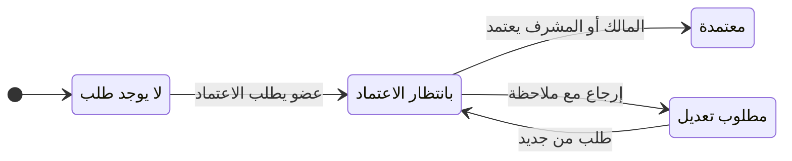

# MindTrace — متطلبات النظام

آخر تحديث: 4 أكتوبر 2026 · فريق MindTrace

النسخة الحية للتحرير والتعليق على claude.ai؛ هذه نسخة المستودع.

## مقدمة

هذي الوثيقة تحدد متطلبات MindTrace كما هي في فرع main على GitHub، وتضيف متطلبات ميزتين ما انبنت للحين: ملف العضو والتعاون.

- **النطاق:** منصة الويب (الواجهة والباك اند). جهاز ESP32 وبرنامج الجسر خارج هذي الوثيقة.
- **الترقيم:** كل متطلب له رمز من القسم ورقم، مثل EXP-03. الرمز ثابت ولا يتغير حتى لو تغيّر ترتيب الجدول.
- **الحالة:** «منفّذ» يعني موجود في main ومغطّى باختبارات. «مطلوب» يعني متطلب متفق عليه وما انبنى.
- **كلمة «لازم»** تعني شرط إلزامي، والنظام يرفض أي طلب يخالفه.

## الأدوار والمصطلحات

الصلاحيات كلها تعتمد على دور المستخدم في التجربة أو في الفريق. الشخص الغريب ما يشوف أي شيء.

| المصطلح | التعريف |
| --- | --- |
| مستخدم | أي شخص عنده حساب. له معرّف ثابت بالشكل MT-XXXXXXXX. |
| مالك التجربة | من أنشأ التجربة. له كل الصلاحيات عليها. |
| متعاون | شخص أضافه أحد أعضاء التجربة بإيميله أو معرّفه. دوره في التجربة «محرّر». |
| عضو التجربة | المالك، أو متعاون، أو عضو في الفريق اللي التجربة مشتركة معه. |
| مالك الفريق | من أنشأ الفريق. واحد فقط لكل فريق، وما يقدر يغادر. |
| مشرف | عضو رفّعه المالك. يدير الأعضاء ورابط الدعوة. |
| عضو الفريق | يشوف تجارب الفريق ويضيف ملاحظات فيها. |
| غريب | أي مستخدم ما له دور. أي طلب منه على تجربة أو فريق يرجع «غير موجود» (404). |

**الملاحظات:** نوع واحد فقط هو «ملاحظة». نوعا «فرضية» و«قرار» انحذفا بالكامل، وأي ملاحظة قديمة منهما تتحول تلقائيًا إلى «ملاحظة».

**مصدر الملاحظة:** مكتوبة باليد (manual) أو مسجّلة بالجهاز (recording).

## التجارب والملاحظات

التجربة هي الوحدة الأساسية في النظام، وكل ملاحظة تتبع تجربة وحدة. كل المتطلبات هنا منفّذة.

| الرمز | المتطلب | القواعد والتحقق | من يقدر |
| --- | --- | --- | --- |
| EXP-01 | إنشاء تجربة | العنوان لازم، بحد أقصى 160 حرف. الوصف اختياري بحد 1000 حرف. الوسوم حتى 12 وسم، كل واحد حتى 30 حرف. يتولّد رمز تلقائي EXP-رقم، والحالة تبدأ «نشطة». يقدر يربطها بفريق وقت الإنشاء (TEAM-09). | أي مستخدم |
| EXP-02 | تغيير الحالة | ثلاث حالات فقط: نشطة، متوقفة، مكتملة. الضغط على الزر النشط يرجّعها «نشطة». الواجهة تتغير فورًا وترجع لو السيرفر رفض. يوصل إشعار لباقي الأعضاء. | أي عضو في التجربة |
| EXP-03 | تعديل العنوان والوصف والوسوم | نفس قواعد EXP-01. | المالك فقط |
| EXP-04 | حذف التجربة | يطلب تأكيد. يحذف معها الملاحظات، والمتعاونين، والإشعارات، والتسجيل الأصلي وملفات الصوت. بعد الحذف يرجع للوحة التحكم. | المالك فقط |
| EXP-05 | البحث والفلترة والترتيب | البحث في العنوان والوصف والرمز والوسوم، بحد 100 حرف. فلتر حسب الحالة. ترتيب الأحدث أو الأقدم. القائمة تشمل تجاربي والمشتركة معي وتجارب فرقي. | أي مستخدم |
| NOTE-01 | إضافة ملاحظة | النص لازم، بحد 5000 حرف. تنكتب أو تنملى بالصوت، والمستخدم يراجعها قبل الحفظ. Ctrl+Enter يحفظ. يوصل إشعار لباقي الأعضاء. | أي عضو في التجربة |
| NOTE-02 | تعديل ملاحظة | تعديل النص أو النوع. تعديل نص ملاحظة مسجّلة يلغي علامة «تحتاج مراجعة» لأن إنسان صحّحها. يوصل إشعار لباقي الأعضاء. | كاتبها أو مالك التجربة |
| NOTE-03 | حذف ملاحظة | يطلب تأكيد داخل السطر نفسه. | كاتبها أو مالك التجربة |
| NOTE-04 | عرض النوع والفلترة | (أُلغي) ما فيه أنواع ولا فلترة حسب النوع، كل الملاحظات من نوع واحد. | أي عضو |
| NOTE-06 | الملاحظات المسجّلة | تظهر مع وقتها داخل التسجيل، وعلامة «مسجّلة»، ومشغّل صوت لو الملف موجود. علامة «تحتاج مراجعة» تظهر بس لو ثقة التفريغ أقل من 85%، ومعها القراءة الثانية لو موجودة. | أي عضو |
| NOTE-07 | الكاتب | لو التجربة مشتركة يظهر اسم كاتب كل ملاحظة وصورته الرمزية. | أي عضو |

## الذكاء الاصطناعي (DeepSeek)

التحليل يشتغل على السيرفر بمفتاح DeepSeek. بدون المفتاح الميزة تظهر معطّلة، وباقي النظام يشتغل عادي. كل المتطلبات هنا منفّذة.

| الرمز | المتطلب | التفاصيل |
| --- | --- | --- |
| AI-01 | تشغيل التحليل | أي عضو يقدر يطلب تحليل التجربة. الطلب ينضاف للطابور ويرجع فورًا، والواجهة تعرض حالته: بالانتظار، يشتغل، تم، فشل. التجارب المرفوعة من الجهاز تنضاف للتحليل تلقائيًا. الفشل ما يوقف النظام، ينحفظ سببه ويقدر المستخدم يعيد. |
| AI-02 | محتوى التحليل | ملخص، نقاط أساسية، خطوات تالية، درجة جودة التوثيق من 100، وقائمة الملاحظات اللي تحتاج مراجعة. النتيجة تنحفظ مع وقت آخر تحديث. |
| AI-03 | تجاهل الملاحظات غير المرتبطة | الملاحظات اللي ما لها علاقة بالتجربة ما تدخل في الملخص ولا الدرجات. تنرجع أرقامها، والخط الزمني يعلّم عليها «تجاهلها التحليل». |
| AI-04 | تقدير الأصالة | يبحث في مصادر علمية فقط، وما يستخدم الويب العام. يعطي درجة من 0 إلى 100: 100 تعني ما فيه شيء مشابه منشور، و0 تعني نفس العمل منشور. الواجهة تشرح إن الأعلى أفضل. |
| AI-05 | متى تظهر الأصالة | لازم ما تظهر أي درجة أصالة قبل اكتمال التحليل. قبله تظهر «لم تُحلَّل»، لأن القيمة الافتراضية (50) مو رقم حقيقي. |
| AI-06 | الترجمة | لو لغة الواجهة غير لغة التحليل، يترجم مرة وحدة بطلب قصير وتنحفظ الترجمة. التبديل بين اللغتين بعدها ما يكلف طلب جديد. لو فشلت، يظهر زر يعيد المحاولة. |
| AI-07 | تصنيف النوع | (أُلغي) ما فيه تصنيف للنوع. |
| AI-08 | الأرقام في لوحة التحكم | متوسط جودة التوثيق وعدد الملاحظات اللي تحتاج مراجعة ينحسبون من التجارب المحلّلة بس. لو ما فيه أي تحليل تظهر العلامة «—» بدل الرقم. |

## التقارير

تقرير «الملخص والتحليل» ينبني من مصدر واحد، فنسخة PDF ونسخة Word دايمًا فيهم نفس المحتوى. كل المتطلبات هنا منفّذة.

| الرمز | المتطلب | التفاصيل |
| --- | --- | --- |
| REP-01 | التصدير | زر «تصدير» في رأس صفحة التجربة فيه خياران: PDF وWord. متاح لأي عضو في التجربة. |
| REP-02 | PDF | يفتح صفحة التقرير بتصميم جاهز للطباعة، ويفتح نافذة الحفظ كـ PDF مباشرة. فيها زر رجوع للتجربة وزر تحميل Word. |
| REP-03 | Word | ملف .docx ينبني داخل المتصفح وينحمّل مباشرة، بدون ما يروح للسيرفر. اسم الملف من عنوان التجربة. |
| REP-04 | الهوية | الشعار في أعلى التقرير، وألوان المشروع وألوان أنواع الملاحظات، واتجاه النص حسب اللغة (يمين لليسار للعربي). |
| REP-05 | بيانات التجربة | العنوان، الرمز، الحالة، الوصف، المالك والمتعاونون، تاريخ البدء وآخر تحديث، والمدة، ووقت إنشاء التقرير. |
| REP-06 | الملخص والتحليل | الملخص، النقاط الأساسية، الخطوات التالية، درجة جودة التوثيق مع نقاط القوة والنواقص، والأصالة مع سببها والأبحاث المشابهة. لو التجربة ما تحلّلت يقول التقرير ذلك بوضوح، وما يعرض أصالة (AI-05). |
| REP-07 | الملاحظات | عدد الملاحظات من كل نوع، ثم الخط الزمني كامل. كل ملاحظة معها نوعها، ووقتها (أو موضعها في التسجيل)، وكاتبها، وعلامة «مسجّلة» و«تحتاج مراجعة» لو تنطبق. لو ما فيه ملاحظات يقول ذلك. |
| REP-08 | اللغة | التقرير بلغة الواجهة الحالية، والتحليل بترجمته لو موجودة (AI-06). |
| REP-09 | الأخطاء | لو فشل التصدير تظهر رسالة واضحة، والزر يبيّن إنه يشتغل وقت التجهيز. |

## الواجهة

الواجهة مبنية على هوية «الأثر»: كل تجربة تظهر معها آثار ملاحظاتها الحقيقية، مو رسم شكلي. كل المتطلبات هنا منفّذة.

| الرمز | المتطلب | التفاصيل |
| --- | --- | --- |
| UI-01 | أثر البطاقة | كل بطاقة تجربة فيها خط صغير: نقطة لكل ملاحظة ملوّنة حسب نوعها (آخر 40 ملاحظة)، ومنحنى يوضح وين تزحمت. تحته عدد الملاحظات من كل نوع. |
| UI-02 | موضع النقطة | لو كل الملاحظات لها وقت داخل التسجيل يُستخدم، وإلا وقت كتابتها. الملاحظات اللي بنفس اللحظة تتباعد شوي عشان ما تختفي وحدة تحت الثانية. ملاحظة وحدة تظهر بالنص. |
| UI-03 | أثر صفحة التجربة | أثر كبير في الرأس الداكن مع وقت البداية والنهاية. كل نقطة زر: الضغط عليها ينزل للملاحظة ويميّزها ثانية ونص. التلميح يعرض نوعها ووقتها وأول النص. |
| UI-04 | رأس صفحة التجربة | خلفية داكنة فيها: الحالة، الرمز، تاريخ البدء، الأشخاص، العنوان والوصف، أزرار الحالة، إضافة أشخاص، الفريق، التصدير، الحذف، زر التسجيل الصوتي، والأثر. |
| UI-05 | أزرار الحالة | الزر يقول وش بيسوي: «إكمال» أو «إعادة فتح»، «إيقاف مؤقت» أو «استئناف». الزر النشط ملوّن. |
| UI-06 | لوحة التحكم | تحية حسب وقت اليوم والتاريخ، زر تجربة جديدة، أربع أرقام حقيقية (التجارب النشطة من المجموع، ملاحظات هذا الأسبوع مقابل الماضي، جودة التوثيق، الملاحظات اللي تحتاج مراجعة)، بطاقة الفريق لو موجود، ثم بطاقات التجارب مع البحث والفلتر والترتيب. |
| UI-07 | بطاقة التجربة | الحالة، الرمز، اسم الفريق أو «مشتركة من فلان»، العنوان، الوصف، الأثر، آخر تحديث، الأشخاص، الأصالة أو «لم تُحلَّل»، وأزرار الحالة وإضافة أشخاص والحذف (للمالك). |
| UI-08 | الشريط الجانبي | داكن، فيه: مساحة العمل، الفريق، وحتى 6 تجارب نشطة، ثم بطاقة «جهاز التسجيل متصل»، ثم الإعدادات والملاحظات والمستخدم. الصفحة الحالية مميّزة. ينطوي على الشاشات الكبيرة ويصير قائمة منبثقة في الجوال. |
| UI-12 | اللغة | عربي وإنجليزي، يتغير بضغطة من الشريط العلوي، والاتجاه ينقلب (يمين لليسار للعربي). الخيار ينحفظ للمرة الجاية. |
| UI-13 | الوضع الداكن | فاتح وداكن، الافتراضي حسب إعداد الجهاز. كل النصوص واضحة في الوضعين. |
| UI-14 | الخط والشعار | خط IBM Plex Sans Arabic للنصوص وIBM Plex Mono للأرقام والرموز. الشعار الجديد في الشريط والتقارير. |
| UI-15 | التنقل | كل صفحة تفتح من فوق، إلا لو المستخدم فتح ملاحظة معيّنة فينزل لها. |

## الحساب

الإيميل هو اسم الدخول وما يتغير، والمعرّف MT-XXXXXXXX ثابت لكل مستخدم. كل المتطلبات هنا منفّذة.

| الرمز | المتطلب | القواعد والتحقق |
| --- | --- | --- |
| ACC-01 | إنشاء حساب | الاسم والإيميل وكلمة المرور لازمة، والمختبر اختياري. كلمة المرور من 8 إلى 200 حرف. الإيميل ما يتكرر (بدون حساب حالة الأحرف). يتولّد المعرّف تلقائيًا، والمستخدم يدخل مباشرة. |
| ACC-02 | تسجيل الدخول | بالإيميل وكلمة المرور، مع خيار «تذكّرني». الجلسة تبقى 30 يوم بالافتراض. 5 محاولات خاطئة توقف الدخول 5 دقائق. رسالة الخطأ ما تقول إذا الإيميل موجود أو لا. |
| ACC-03 | تسجيل الخروج | ينهي الجلسة الحالية على السيرفر. |
| ACC-04 | المعرّف | المستخدم يشوف معرّفه في الإعدادات وينسخه بضغطة، عشان يشاركه بدل إيميله. |
| ACC-05 | تعديل الملف الشخصي | الاسم (لازم، حتى 80 حرف) والمختبر (حتى 80 حرف). الإيميل ما يتغير. الاسم الجديد يظهر في كل مكان مباشرة. |
| ACC-06 | تغيير كلمة المرور | يطلب كلمة المرور الحالية، والجديدة لازم تختلف عنها. بعد التغيير تنتهي كل الجلسات الثانية، وتبقى الجلسة الحالية ومفاتيح الجسر. |
| ACC-07 | «نسيت كلمة المرور» | يرسل رابط للإيميل صالح 60 دقيقة، يستخدم مرة وحدة، وطلب جديد يلغي الرابط القديم. الرد نفسه سواء الإيميل مسجّل أو لا. لو ما فيه إعداد للبريد، ينكتب الرابط في سجل السيرفر. |
| ACC-08 | تعيين كلمة مرور جديدة | صفحة الرابط تطلب الكلمة الجديدة بنفس قواعد ACC-01. بعدها تنتهي كل الجلسات. الرابط المنتهي أو المستخدم يعطي رسالة واضحة. |
| ACC-09 | حذف الحساب | يطلب كلمة المرور. يحذف الحساب، وتجاربه بملاحظاتها وتسجيلاتها، وملاحظاته في تجارب غيره، والفرق اللي يملكها. التجارب اللي هو متعاون فيها تبقى عند أصحابها. |

## المشاركة والفريق

التجربة تنشارك بطريقتين: مع أشخاص بأسمائهم (متعاونون)، أو مع فريق كامل. كل المتطلبات هنا منفّذة.

### المتعاونون والإشعارات

| الرمز | المتطلب | القواعد والتحقق |
| --- | --- | --- |
| SHR-01 | إضافة متعاون | بالإيميل أو المعرّف، بمطابقة تامة فقط (ما فيه تصفّح للمستخدمين). ما ينضاف المالك أو شخص موجود. يظهر آخر من أضفتهم للاختيار السريع. الشخص المضاف يوصله إشعار. أي عضو في التجربة يقدر يضيف. |
| SHR-02 | إزالة متعاون | المالك فقط، مع تأكيد. |
| SHR-03 | الإشعارات | توصل لكل أعضاء التجربة ما عدا اللي سوّى الفعل: ملاحظة جديدة، تعديل ملاحظة، تغيير حالة، إضافة شخص. جرس بعدّاد غير المقروء، وزر «تحديد الكل كمقروء»، والضغط على إشعار يفتح تجربته. النص مترجم حسب اللغة. |

### الفريق

| الرمز | المتطلب | القواعد والتحقق |
| --- | --- | --- |
| TEAM-01 | إنشاء فريق | الاسم لازم، حتى 80 حرف. المنشئ يصير مالكه، ويتولّد رابط دعوة. |
| TEAM-02 | صفحة الفريق | الاسم، دوري، عدد الأعضاء والتجارب، قائمة الأعضاء (المالك ثم المشرفون ثم الأعضاء)، ولكل عضو دوره ومختبره وعدد تجاربه في الفريق وملاحظاته خلال 14 يوم، والتجارب المشتركة. |
| TEAM-03 | إضافة عضو | بالإيميل أو المعرّف لشخص عنده حساب. المالك يضيف عضو أو مشرف، والمشرف يضيف عضو فقط. ما ينضاف شخص موجود. يوصله إشعار. |
| TEAM-04 | رابط الدعوة | يظهر للمالك والمشرف فقط، مع نسخ وإعادة تعيين (القديم يتوقف فورًا). المنضم بالرابط يصير عضو، والمالك والمشرفون يوصلهم إشعار. |
| TEAM-05 | صفحة الانضمام | تعرض اسم الفريق ومنشئه وعدد أعضائه وزر «انضم». لو المستخدم عضو أصلًا تقول ذلك. الرابط الغلط أو اللي انعاد تعيينه يعطي رسالة واضحة. الانضمام مرتين ما يسوي شيء. |
| TEAM-06 | الدعوة والمستخدم غير مسجّل | لو فتح الرابط وهو مو مسجّل، ينحفظ الرابط، وبعد الدخول أو إنشاء الحساب يرجع لصفحة الانضمام. صفحة الفريق فيها خانة لصق الرابط أو الرمز. |
| TEAM-07 | الأدوار | المالك فقط يغيّر الدور بين عضو ومشرف، ودور المالك ما يتغير. أيقونة الدور تظهر للمالك والمشرف فقط. إيميلات الأعضاء تظهر للمالك والمشرف فقط. |
| TEAM-08 | الإزالة والمغادرة والحذف | أي عضو يغادر. المالك يشيل أي أحد، والمشرف يشيل الأعضاء فقط. المالك ما يغادر، بس يحذف الفريق أو يغيّر اسمه. حذف الفريق يبقي التجارب عند أصحابها بدون مشاركة. كلها بتأكيد. |
| TEAM-09 | ربط التجربة بالفريق | وقت الإنشاء («لي فقط» أو فريق) أو بعدين من رأس التجربة. المالك فقط، ولفريق هو عضو فيه. كل أعضاء الفريق يصيرون محرّرين: يشوفون ويضيفون ملاحظات ويغيّرون الحالة، بس ما يحذفونها ولا يعدّلون عنوانها ولا يغيّرون فريقها. إلغاء الربط يرجّع التجربة مخفية عنهم. |
| TEAM-10 | الفريق في باقي الواجهة | بطاقة لكل فريق في لوحة التحكم، وعلامة باسم الفريق على بطاقة التجربة، ورابط «الفريق» في الشريط الجانبي، وإشعارات الفريق تفتح صفحته. |
| TEAM-11 | الخصوصية | الغريب ياخذ «غير موجود» لأي فريق، وما يعرف حتى إذا الإيميل اللي يحاول يضيفه موجود. |

## ملف العضو (مطلوب)

صفحة لكل عضو داخل فريق، توضح شغله في الفريق بنظرة وحدة. الملف دايمًا مرتبط بفريق: نفس الشخص في فريقين له ملفان مختلفان، وما تظهر فيه تجارب خارج الفريق.

| الرمز | المتطلب | التفاصيل |
| --- | --- | --- |
| MEM-01 | الوصول | من الضغط على اسم العضو في صفحة الفريق. الرابط بالشكل /team/{رقم الفريق}/members/{معرّف العضو}. |
| MEM-02 | من يشوفه | أعضاء نفس الفريق فقط. الغريب ياخذ «غير موجود» (404)، وكذا لو الشخص مو في الفريق. |
| MEM-03 | الرأس | الصورة الرمزية، الاسم، شارة الدور، المعرّف، المختبر، تاريخ الانضمام للفريق. الإيميل يظهر للمالك والمشرف فقط (نفس TEAM-07). |
| MEM-04 | الأرقام | أربع بطاقات: تجاربه في الفريق، ملاحظاته خلال 14 يوم، مهامه المفتوحة، متوسط جودة التوثيق في تجاربه المحلّلة. الرقم اللي ما له بيانات يظهر «—». بطاقة المهام تظهر بس لو انبنى التعاون (COL-08). |
| MEM-05 | تجاربه | تجارب الفريق اللي هو مالكها أو كتب فيها ملاحظات. لكل وحدة: العنوان، دوره (مالك أو مشارك)، عدد ملاحظاته فيها، آخر تحديث، الحالة. الأحدث فوق، والضغط يفتح التجربة. |
| MEM-06 | آخر نشاطه | آخر 20 حدث في تجارب الفريق: أضاف ملاحظة (مع أول النص)، غيّر حالة، انضم للفريق. كل حدث له وقت نسبي ويفتح مكانه. هذا يحتاج جدول سجل أحداث جديد، لأن تغيير الحالة ما ينحفظ حاليًا. |
| MEM-07 | إجراءات المالك والمشرف | المالك: تغيير الدور وإزالة العضو. المشرف: إزالة الأعضاء. نفس قواعد TEAM-07 وTEAM-08. «إسناد مهمة» ينضاف مع التعاون. |
| MEM-08 | ملفي أنا | لو المستخدم فتح ملفه، تظهر نفس الصفحة بدون إجراءات على نفسه، مع رابط للإعدادات لتعديل اسمه. |
| MEM-09 | الواجهة البرمجية | مسار واحد يرجّع كل بيانات الملف: GET /api/teams/{id}/members/{معرّف}. الاستعلامات مجمّعة بحيث ما يزيد عددها مع عدد التجارب. |
| MEM-10 | الاختبارات | الغريب ما يشوف الملف، العضو ما يشوف الإيميل، الأرقام صحيحة، وتجارب خارج الفريق ما تظهر. |

## التعاون (مطلوب)

التعاون يضيف أربع أدوات داخل التجربة: التعليقات، والإشارة @، والمهام، والاعتماد. كل شخص يشوف التجربة يقدر يستخدمها، إلا الاعتماد فهو لمالك الفريق والمشرفين.

الواجهة: تبويب جديد «النقاش والمهام» في صفحة التجربة بجانب «نظرة عامة» و«رؤى»، وشريط الاعتماد في الرأس الداكن، وزر «تعليق» على كل ملاحظة مع عدد التعليقات.

### التعليقات والإشارة @

| الرمز | المتطلب | القواعد والتحقق |
| --- | --- | --- |
| COL-01 | إضافة تعليق | على التجربة كلها أو على ملاحظة معيّنة. النص لازم، حتى 2000 حرف. التعليق على ملاحظة يعرض أول نصها، والضغط عليه ينزل لها. التعليقات بترتيب وقتها، مع الكاتب والوقت النسبي. |
| COL-02 | حذف تعليق | كاتبه أو مالك التجربة، بتأكيد. سطور سجل الاعتماد ما تنحذف. حذف الملاحظة يحذف تعليقاتها. |
| COL-03 | الإشارة @ | كتابة @ تفتح قائمة بالأشخاص اللي يشوفون التجربة (المالك والمتعاونون وأعضاء فريقها)، تتفلتر مع الكتابة وتشتغل بالأسهم وEnter. الاسم ينحفظ مربوط بالمعرّف، فتغيير الاسم بعدين ما يكسر الإشارة. الإشارة تظهر بلون مميّز. |
| COL-04 | إشعارات التعليق | المُشار له يوصله «فلان ذكرك»، بشرط إنه يشوف التجربة. كاتب الملاحظة يوصله «علّق على ملاحظتك» إذا ما انذكر. الشخص ما يوصله إشعار عن شيء سوّاه هو، وما يوصله إشعارين لنفس التعليق. الغريب المُشار له ما يوصله شيء. |

### المهام

| الرمز | المتطلب | القواعد والتحقق |
| --- | --- | --- |
| COL-05 | إضافة مهمة | العنوان لازم، حتى 200 حرف. اختياري: المسؤول (لازم يكون من أعضاء التجربة)، وتاريخ الاستحقاق، وربطها بملاحظة. تنضاف من تبويب المهام أو من زر على الملاحظة. المسؤول يوصله إشعار. |
| COL-06 | إنجاز المهمة | أي عضو في التجربة يعلّم عليها أو يرجّعها مفتوحة. ينحفظ من أنجزها ومتى، ومنشئها يوصله إشعار. |
| COL-07 | تعديل وحذف المهمة | العنوان والمسؤول والتاريخ، لمنشئها أو مالك التجربة فقط. تغيير المسؤول يشعر المسؤول الجديد. |
| COL-08 | مهامي | قسم «مهامي» في لوحة التحكم: المهام المفتوحة المسندة لي من كل التجارب، الأقرب استحقاقًا فوق. المتأخرة بلون تحذيري. على بطاقة التجربة عدد مهامها المفتوحة. |

### الاعتماد

| الرمز | المتطلب | القواعد والتحقق |
| --- | --- | --- |
| COL-09 | شرط الفريق | الاعتماد للتجارب المشتركة مع فريق فقط. بدون فريق يظهر تلميح: «شارك التجربة مع فريق أولًا». |
| COL-10 | طلب الاعتماد | أي عضو في التجربة، مع ملاحظة اختيارية. ما ينطلب مرتين وهو معلّق. مالك الفريق والمشرفون يوصلهم إشعار. |
| COL-11 | اعتماد أو إرجاع | مالك الفريق أو المشرف فقط، وبس لو فيه طلب معلّق. «إرجاع» يطلب ملاحظة تشرح المطلوب. اللي طلب ومالك التجربة يوصلهم إشعار. |
| COL-12 | السجل | كل خطوة تضيف سطر في النقاش: من، ومتى، وملاحظته. شريط الاعتماد يعرض الحالة الحالية ومن اعتمد ومتى، والأزرار تظهر حسب دور المستخدم. |

الرسم تحت يوضح حالات الاعتماد والانتقال بينها.

كل سهم يضيف سطرًا في النقاش ويرسل إشعارًا.

## متطلبات غير وظيفية

الأمان واللغة منفّذة، وأغلب متطلبات الأداء والجودة مطلوبة.

| الرمز | المتطلب | التفاصيل | الحالة |
| --- | --- | --- | --- |
| NFR-01 | تخزين كلمات المرور | مشفّرة بـ scrypt، وما تنحفظ أبدًا كنص. روابط الاستعادة ومفاتيح الجسر ينحفظ الـ hash حقها بس. | منفّذ |
| NFR-02 | الجلسة وCSRF | كوكي HttpOnly وSameSite=Lax. أي طلب كتابة لازم يحمل الهيدر X-Requested-With: mindtrace. | منفّذ |
| NFR-03 | عدم كشف البيانات | أي تجربة أو ملاحظة أو فريق ما يخص المستخدم يرجع 404، نفس جواب «غير موجود». البحث عن المستخدمين بمطابقة تامة فقط. | منفّذ |
| NFR-04 | حدود المدخلات | كل حقل له حد أقصى (مذكور في أقسامه)، والحقول غير المعروفة تنرفض. الملفات المرفوعة لها حد حجم. | منفّذ |
| NFR-05 | اللغة والاتجاه | كل نص في الواجهة باللغتين، والنصوص المختلطة تترتب باتجاهها الصحيح. | منفّذ |
| NFR-06 | رسائل الخطأ بالعربي | السيرفر يرجّع رمز للخطأ، والواجهة تترجمه. حاليًا رسائل السيرفر تطلع بالإنجليزي. | مطلوب |
| NFR-07 | سرعة القوائم | قائمة التجارب والإحصائيات بعدد ثابت من الاستعلامات مهما كثرت التجارب. تقسيم صفحات للقوائم الطويلة. | مطلوب |
| NFR-08 | فتح أسرع | مكتبة Word ما تنحمّل إلا عند التصدير، عشان الملف الأول اللي ينحمّل أصغر. | مطلوب |
| NFR-11 | ثبات المكتبات | إصدارات مكتبات الباك اند محدّدة بالضبط في requirements.txt. | مطلوب |
| NFR-13 | ترحيل قاعدة البيانات | أي تغيير في الجداول يتطبّق على القواعد القديمة بدون ضياع بيانات. حاليًا بطريقة يدوية بسيطة، والمطلوب نظام مثل Alembic. | منفّذ جزئيًا |
| NFR-15 | صلاحية روابط الدعوة | رابط دعوة الفريق ينتهي بعد 7 أيام. | مطلوب |
